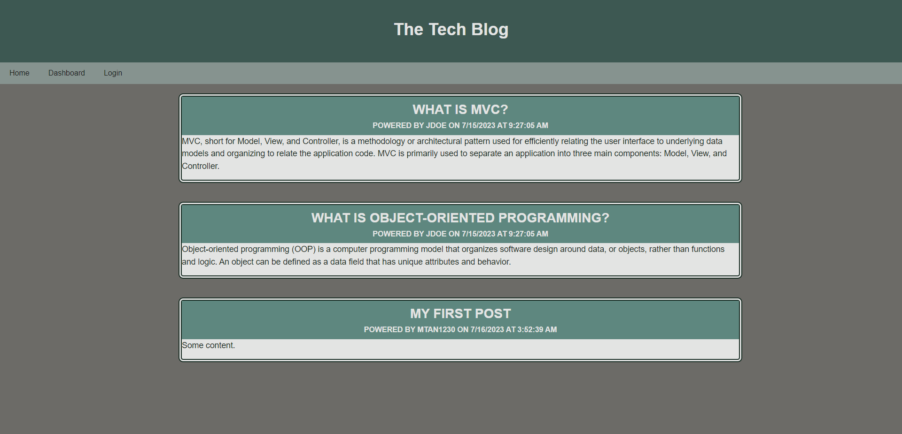

# MVC Tech Blog  

[](./LICENSE)  

## Description  

This is a full-stack blog site, built with MVC architectural structure, using Handlebars.js as the templating language, Sequelize as the ORM, and the express-session for authentication.

## Table of Contents  
- [Link](#link)
- [Screenshot](#screenshot)
- [Installation](#installation)
- [Usage](#usage)
- [License](#license)
- [Contribute](#contribute)
- [Tests](#tests)
- [Questions](#questions)  

## Link

Page published at https://stormy-beach-92293-4b29936c94f2.herokuapp.com/ 

## Screenshot



## Installation  

```bash
npm i  
```

## Usage  

```bash
npm start
```

## License  

This project is licensed under the [MIT license](LICENSE).  

## Contribute  

N/A  

## Tests  

N/A  

## Questions  

If you have any questions about the repository, open an issue or contact me directly at [m.tan1230@gmail.com](mailto:m.tan1230@gmail.com). You can find more of my work at [Mtan1230](https://github.com/Mtan1230).
